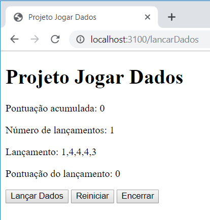

# Projeto Jogar Dados

Este é um projeto introdutório ao ambiente Node.js e à arquitetura MVC (Model-View-Controller) e consiste em um jogo de dados. No jogo o usuário pode inicia um novo jogo e pode relizar vários lançamentos nesse jogo, podendo pontuar em cada lançamento. O sistema mantem a pontuação do usuário a cada jogo. Esta aplicação será implementada utilizando o Github.

## Instruções

### Etapa 1: Preparando o ambiente

1. Criar um repositório no GitHub chamado `learning-nodejs-projeto-jogar-dados`. Selecione `.gitignore` para `Node.js`.

2. No diretório de projetos criar um clone do repositório `learning-nodejs-projeto-jogar-dados` com o comando:
```bash
$ git clone https://github.com/username/learning-nodejs-projeto-jogar-dados.git
```
Com isso será criada uma pasta com o nome `learning-nodejs-projeto-jogar-dados`.

3. Dentro da pasta `learning-nodejs-projeto-jogar-dados` executar o comando `init` do Node.js para iniciar o projeto, da seguinte forma:
```bash
$ cd learning-nodejs-projeto-jogar-dados
$ npm init
```

4. Criar a seguinte árvore de diretórios e arquivos.
- `learning-nodejs-projeto-jogar-dados`
	- config
	- node_modules (já foi criado pelo node após a instalação dos pacotes)
	- app
		- controllers
		- models
		- public
		- views
		- routes
	- app.js
	- package.json (já foi criado pelo init)

5. Instalar os pacotes `express`, `consign`, `ejs`. Não esqueça da opção `--save` para que fiquem registrados no arquivo `package.json`.
```bash
$ npm install express consign ejs --save
```

### Etapa 2: Configurando a aplicação

1. Criar um arquivo `server.js` na pasta `config` com o seguinte conteúdo:
```js
/* importar o módulo do framework express */
var express = require('express');

/* importar o módulo consign */
var consign = require('consign');

/* iniciar o objeto do express */
var app = express();

/* setar as variáveis 'view engine' e 'views' do express */
/* indica qual é o motor de geração de views */
app.set('view engine', 'ejs');
/* inidica qual é o diretório onde estão as views */
app.set('views', './app/views' );

/* configurar o middleware express.static que diz onde estão os objetos estáticos */
app.use(express.static('./app/public'));

/* Uma especie de autoload do PHP */
consign()
	.include('./app/routes')
	.include('./app/models')
	.include('./app/controllers')
	.into(app);

/* exportar a o objeto app para a nossa aplicação. 
O module representa o móduloatual da aplicação.
*/
module.exports = app;
```

2. Crie o arquivo app.js no diretório raiz do projeto com o seguinte código:
```js
/* Importar as configurações do arquivo ./config/server.js */
var app = require('./config/server');

/* Especificar a porta que nossa aplicação vai escutar */
app.listen(3100, function(){
	console.log('A aplicação está online.');
})
```
A porta que a nossa aplicação escutará será `localhost:3100`.

3. Para verificar que a nossa aplicação está funcionando corretamente levantamos (*startamos*) a aplicação com `nodemon`:
```bash
$ nodemon app
```
Esse commando vai iniciar o arquivo `app.js` e vai monitorar todas as alterações que nossos arquivos tiverem. Após isso, abrir no browser o endereço `localhost:3001` e obteremos como resultado um título de página com `Error` e o conteúdo:
```
Cannot GET /
```
Isso ocorre pelo fato de que a aplicação está online mas não tem nada para responder ao pedido de uma página web (Requisição HTTP que o Browser faz para esse endereço).

### Etapa 3: Criando rotas e páginas

1. Criar um arquivo de rotas com o seguinte conteúdo. Cada rota corresponde a uma funcionalidade do sistema, mas como ainda não estão implementadas vamos deixar apenas um aviso no log do servidor e também uma mensagem para o cliente.
```js
module.exports = function(application){

    application.get('/', function(req,res){
        res.render('home');
    });

    application.get('/iniciar', function(req,res){    	
    	console.log('routes: /iniciar');
        res.send('Esta funcionalidade não foi implementada ainda.');
    });

    application.get('/lancarDados', function(req,res){
    	console.log('routes: /lancarDados');
    	res.send('Esta funcionalidade não foi implementada ainda.'); 
    });

    application.get('/reiniciar', function(req,res){
    	console.log('routes: /reiniciar');    	        
    	res.send('Esta funcionalidade não foi implementada ainda.');
    });
    
    application.get('/encerrar', function(req,res){
    	console.log('routes: /encerrar');        
    	res.send('Esta funcionalidade não foi implementada ainda.');
    });
}
```

2. Nossa primeira página será `home.ejs` a qual será renderizada quando houver uma requisição HTTP usando método GET no endereço raiz da nossa aplicação. Neste momento nossa tarefa é deixar nossas páginas funcionais, para posteriormente, nos preocuparmos com a estética. O código da nossa primeira versão de `home.ejs` é o seguinte:
```js
<!DOCTYPE html>
<meta charset="utf-8">
<html>
<head>
	<title>Projeto Jogar Dados</title>
</head>
<body>

<main>

	<h1>Projeto Jogar Dados</h1>

	<button type="button" id="buttonComecar">Começar</button>

</main>

</body>

<script src="js/jquery-3.4.0.min.js"></script>

<script type="text/javascript">

	$(document).ready(function() {
    	$('#buttonComecar').click(function(){
    		location.href='iniciar';
    	} );
	});
	
</script>

</html>
```

Neste exemplo usamos a biblioteca de JQuery, disponível em https://jquery.com/. Para usá-la vamos baixar essa biblioteca e salvá-la na pasta `public/js/` com o nome `js/jquery-3.4.0.min.js` ou similar (se for outra versão). A pasta `js` dentro da pasta `public` também deve ser criada, pois não foi criada ainda. A implementação em JQuery indica que após carregado ao documento HTML completo ele irá criar uma função para o método `onclick` do elemento `buttonComecar`. O endereço atribuído a `location.href` indica que tentaremos acessar via GET o endereço `localhost:3100/iniciar`. Ao rodar a nossa aplicação e clicarmos no botão `Começar` verificaremos a resposta `Esta funcionalidade não foi implementada ainda.`

3. O que queremos é que quando o usuário clicar em `Começar` seja encaminhado para uma página onde possa, de fato, lançar os dados. Para isso vamos alterar o arquivo `routes.js` e no método GET para a rota `/iniciar` vamos escrever uma mensagem no console, para monitorarmos o andamento das requisições do usuário. E pedir para um controller (que vai controllar o que o usuário pode fazer no jogo) iniciar um novo jogo.
```js
application.get('/iniciar', function(req,res){
    	console.log('routes: /iniciar');
        application.app.controllers.jogo.iniciar(application, req, res);
    });
```

Nosso controller ainda não existe mas vamos implementá-lo logo mais.

### Etapa 4: Model-View-Controller

O modelo Movel-View-Controller (MVC) consiste em uma arquitetura de desenvolvimento que divide uma aplicação em três partes interconectadas. Dividir a nossa aplicação em partes é importante para sabermos onde devemos realizar a implementação das diferentes funcionalidades, por exemplo, manipular o evento de um botão, criar uma instância de um objeto, realizar um cálculo ou implementar operações em banco de dados. A seguir temos a definição de cada parte da aplicacão e a sua responsabilidade no nosso projeto.

- A **View** é a apresentação das nossa aplicação para usuário e contem as páginas que serão renderizadas. Está parte é denominada de `Front-end` e está mais preocupada com como as informações são apresentadas ao usuário, envolvendo código fonte implementado em HTML, CSS, Bootstrap e Javascript ou JQuery do lado do cliente (aquele que aparece entre tags `<script> ... </script>`). 

- O **Model** é responsável por gerenciar os dados da nossa aplicação. Quando um usuário realiza uma operação o estado do sistema muda e esta parte da aplicação é reponsável por garantir e manter essa mudança. No nosso projeto, esta parte representa o próprio jogo de dados, ele mantem a pontuação do jogo, permite lançar os dados, e verificar que pontuação conseguiu em cada lançamento. Essas implementações serão feitas na pasta `models`.

- O **Controller** é um meio de campo entre a **View** e o **Model** e permite que ambos se interconectem. Esta parte será responsável por receber requisições da *View* e pedir para *Model* realizar a ação certa. No nosso projeto, quando o usuário pedir para começar o jogo, esta parte será responsável por criar uma instância (objeto) do jogo e pedir para o *Model* zerar a pontuação. Também, quando o usuário quiser lançar os dados, esta parte será responsável por pedir ao *Model* para efetuar um novo lançamento de dados e atualizar a pontuação do jogo. Essas implementações serão feitas na pasta `controllers`.

Existe uma dúvida comum ao implementar o modelo *MVC* que é quem é o responsável por fazer a renderização das *Views*. Uma abordagem consiste em que o *Model* realize a renderização da *View* após ter se modificado e é a que está mais próxima da literatura de MVC. Uma segunda abordagem, mais utilizada na prática, sugere que o *Controller* seja quem, após ter pedido para o *Model* se alterar, decida qual é a *View* que será renderizada para o usuário. Neste projeto vamos utilizar a segunda abordagem. Assim, as nossas renderizações de *Views* estarão concentradas nos arquivos das pastas `routes` e `controllers`.

Como vimos no final da última etapa, no arquivo `routes.js` da pasta `/routes`, ao chegar a requisição via método `GET` para a rota `/iniciar` estamos pedindo para um controller iniciar um jogo. Por sua vez, esse controller deverá criar garantir que uma instância do model seja criada e que a pontuação esteja zerada para, posteriormente, realizar lançamento de dados.

Com isso, vamos criar o nosso primeiro controller. Criar um arquivo chamado `jogo.js` dentro da pasta controller, com o seguinte código:
```js
/*
Controller jogo:
Responsável por:
- manter uma instância do model
- Pedir ao model para iniciar o jogo
- Pedir ao model para lançar os dados
- Pedir ao model para encerrar o jogo
- Pedir ao model para iniciar um novo jogo
*/

var model = require('../models/Jogo');
var jogoModel = undefined;

module.exports.iniciar = function (application, req, res) {
    console.log('controller: iniciar'); 
    console.log('controller: cria instância de jogo');  
    jogoModel =  new model.Jogo();
    console.log('controller: atualiza view - novoJogo');    
    res.render('novoJogo');
}
```

Nesse código anotamos primeiro as responsabilidades desta parte da arquitetura no nosso projeto. Posteriormente criamos uma variável para o nosso model, chamada `jogoModel`, com valor inicial `undefined` para indicar que não temos nenhum jogo ao iniciar a nossa aplicação. Somente na execução do evento  `iniciar` é criada a primeira instância de jogo e armazenada em `jogoModel`.

Para dar continuidade ao nosso trabalho precisamos criar duas coisas. A primeira é construir o `models/Jogo` e a segunda é construir a view `novoJogo` que será renderizada. Para construir o nosso model criamos um arquivo chamado `models/Jogo.js` com o seguinte conteúdo:
```js
function Jogo(dados = 5, lados = 6) {
    console.log('model: executar constructor de jogo');
    this.dados = dados;
    this.lados = dados;
    this.pontos = 0;
    this.n = 0;
}

module.exports.Jogo = Jogo;
```

A função `Jogo` corresponde ao contructor, que tem como parâmetros `dados` e `lados`, os quais correspondem ao número de dados usados no jogo, por padrão 5, e o número de lado de cada dado, por padrão 6. Dentro do constructor criamos os atributos do objeto (usando `this`) `dados`, `lados`, `pontos` e `n`, onde `pontos` e `n` correspondem aos pontos acumulados e o número de lançamentos, respectivamente. A principio esses valores são zero. A última linha é uma forma de deixar visível o nosso Jogo para outros módulos do Javascript, como o `controller`.

Agora precisamos implementar a nossa nova view `views/novoJogo`, para isso criamos um arquivo `novoJogo.ejs` na pasta `views`.
```html
<!DOCTYPE html>
<meta charset="utf-8">
<html>
<head>
    <title>Projeto Jogar Dados</title>
</head>
<body>

<main>

    <h1>Projeto Jogar Dados</h1>
    
    <button type="button" id="buttonLancarDados">Lançar Dados</button>  

</main>

</body>

<script src="js/jquery-3.4.0.min.js"></script>

<script type="text/javascript">

    $(document).ready(function() {
        $('#buttonLancarDados').click(function(){
            location.href='lancarDados';
        });
    });
    
</script>

</html>
```

O botão Lançar Dados permite ao usuário realizar o primeiro lançamento. E para realizar esse lançamento precisamos fazer toda a lógica do nosso jogo no model.

### Etapa 5: Desenvolvimento da lógica do jogo no Model (Backend 1)

Nesta etapa vamos desenvolver a lógica do nosso Jogo. No arquivo `models/Jogo.js` iremos desenvolver as seguintes funcionalidades:
- Constructor de jogo (esta funcionalidade já foi implementada)
- **Novo Jogo**: permite zerar a pontuação do jogo
- Lançar um dado: faz um sorteio de um lado do dado, um valor entre 1 e `lado` (que é por padrão 6). Por ex. o lado de número 5 foi sorteado.
- **Lançar Dados**: lança os dados utilizando a funcionalidade de Lançar um dado. Por ex. para 5 dados o serio poderia ser [5, 5, 1, 2, 3].
- **Contar Dados**: contabiliza os dados dados sorteados. Por ex. para [5, 5, 1, 2, 3] a contagem resulta em [1, 1, 1, 0, 2, 0], indicando que os números 1, 2 e 3 apareceram uma vez, o número 5 apareceu duas vezes e os número 4 e 6 não apareceram nenhuma vez.
- **Analisar Lançamento**: descobre de acordo qual é a pontuação do lançamento de acordo com a contagem. Utilizamos três pontuações: 100 pontos para Generala (os 5 dados com mesmo valor), 50 pontos para Poker (4 dados com mesmo valor), 30 pontos para Full (3 dados de um valor e 2 de outro valor), e 0 para nenhuma das três combinações.
- **Novo Lançarmento**: esta é a função que abstrai as etapas do lançamento e é responsável executar as funcionalidades de: Lançar Dados, Analisar Lançamento e Preparar o resultado para retorno, no formato de JSON ou de objeto JavaScript.

Cada uma dessas funcionalidade será uma função no módulo `models/Jogo.js`. Em Javascript as funcionalidades de um módulo são chamadas de `prototype` (podemos fazer uma analogia com os métodos definidos em uma classe). Embora atualmente Javascript suporte orientação objetos, é muito comum o uso de `prototype`. Nesta etapa vamos implementar dessa forma.
```js
function Jogo(dados = 5, lados = 6) {
    console.log('model: executar constructor de jogo');
    this.dados = dados;
    this.lados = dados;
    this.pontos = 0;
    this.n = 0;
}   

Jogo.prototype.novoJogo = function() {
    console.log('model: novoJogo')
    this.pontos = 0;
    this.n = 0;
}

Jogo.prototype.lancarUmDado = function(lados){
    var valorAleatorio = Math.random(); // No intervalo [0,1]
    var numero = 1 + parseInt(valorAleatorio * (lados-1) ); // No intervalo [1,6]
    return numero;
}

Jogo.prototype.lancarDados = function(){
    console.log('model: lancarDados')
    var lancamento = [];
    for (var i=0; i < this.dados; i++){
        lancamento[i] = this.lancarUmDado(this.lados);
    }
    return lancamento;
}

Jogo.prototype.contarDados = function(lancamento){
    var contagem = Array(this.lados).fill(0);   
    for (var i = 0; i < lancamento.length; i ++){
        var numero = lancamento[i];     
        contagem[numero] += 1;
    }   
    return contagem;
}

const GENERALA = { jogo : 'Generala', pontos : 100 }
const POKER    = { jogo : 'Poker'   , pontos : 50  }
const FULL     = { jogo : 'Full'    , pontos : 30  }
const NADA     = { jogo : 'Nenhum'  , pontos : 0   }

Jogo.prototype.analisarLancamento = function(lancamento){
    var contagem = this.contarDados(lancamento);

    var resultado;

    if ( contagem.find(e => e === 5) )
        resultado = GENERALA;
    else if ( contagem.find(e => e === 4) )
        resultado = POKER;
    else if ( contagem.find(e => e === 3) && contagem.find(e => e === 2) )
        resultado = FULL;
    else
        resultado = NADA;

    return resultado;
}

Jogo.prototype.novoLancamento = function() {
    console.log("model: novoLancamento");
    var lancamento = this.lancarDados();
    console.log("model: analiseLancamento");
    var analiseLancamento = this.analisarLancamento(lancamento);
    this.pontos += analiseLancamento.pontos;
    this.n += 1;    
    console.log("model: prepara o resultado");
    var resultado = {
        pontosAcumulados : this.pontos,
        nLancamentos : this.n,      
        lancamento : lancamento,
        jogoLancamento : analiseLancamento.jogo,
        pontosLancamento : analiseLancamento.pontos
    }    
    return resultado
};

module.exports.Jogo = Jogo;
```

Para verificar que essas funcionalidades estejam funcionando corretamente vamos implementar duas funções para testá-las. Essas funções podem ser implementadas após o código supracitado, como segue:
```js
// Teste do módulo
function testarLancamento(){
    console.log('--- test model jogo: lançar dados e analisar lançamento');
    
    var jogo = new Jogo();
    var lancamento;
    
    for (var i=0; i < 5; i++){
        lancamento = jogo.lancarDados();
        console.log('model: lancamento ',i, lancamento);
        console.log('model: análise do lançamento ', jogo.analisarLancamento(lancamento) );
        }

    console.log('--- end test model jogo');
}

function testarNovoLancamento(){
    console.log('--- test model jogo: novo lançamento');
    
    var jogo = new Jogo();
    var lancamento;
    
    for (var i=0; i < 3; i++){
        resultado = jogo.novoLancamento();
        console.log('model: resultado lancamento ', resultado);     
        }

    console.log('--- end test model jogo');
}

testarLancamento();
testarNovoLancamento();
```

O resultado esperado no nosso console algo parecido com o seguinte:
```bash
[nodemon] starting `node app`                                                                     s
+ .\app\routes\routes.js
+ .\app\routes\routes1.js
+ .\app\models\Jogo.js
+ .\app\controllers\jogo.js
--- test model jogo: lançar dados e analisar lançamento
model: executar constructor de jogo
model: lancarDados
model: lancamento  0 [ 4, 2, 4, 1, 1 ]
model: análise do lançamento  { jogo: 'Nenhum', pontos: 0 }
model: lancarDados
model: lancamento  1 [ 2, 2, 1, 4, 3 ]
model: análise do lançamento  { jogo: 'Nenhum', pontos: 0 }
model: lancarDados
model: lancamento  2 [ 4, 1, 1, 4, 3 ]
model: análise do lançamento  { jogo: 'Nenhum', pontos: 0 }
model: lancarDados
model: lancamento  3 [ 1, 4, 2, 3, 2 ]
model: análise do lançamento  { jogo: 'Nenhum', pontos: 0 }
model: lancarDados
model: lancamento  4 [ 3, 1, 2, 2, 1 ]
model: análise do lançamento  { jogo: 'Nenhum', pontos: 0 }
--- end test model jogo
--- test model jogo: novo lançamento
model: executar constructor de jogo
model: novoLancamento
model: lancarDados
model: analiseLancamento
model: prepara o resultado
model: resultado lancamento  { pontosAcumulados: 30,
  nLancamentos: 1,
  lancamento: [ 3, 1, 1, 3, 3 ],
  jogoLancamento: 'Full',
  pontosLancamento: 30 }
model: novoLancamento
model: lancarDados
model: analiseLancamento
model: prepara o resultado
model: resultado lancamento  { pontosAcumulados: 60,
  nLancamentos: 2,
  lancamento: [ 3, 3, 4, 3, 4 ],
  jogoLancamento: 'Full',
  pontosLancamento: 30 }
model: novoLancamento
model: lancarDados
model: analiseLancamento
model: prepara o resultado
model: resultado lancamento  { pontosAcumulados: 60,
  nLancamentos: 3,
  lancamento: [ 2, 4, 1, 2, 4 ],
  jogoLancamento: 'Nenhum',
  pontosLancamento: 0 }
--- end test model jogo
```

Se foi possível executar esses testes significa que a lógica do nosso jogo de dados está funcionamento bem e gerando os dados que queremos. As linhas que executam esses testes `testarLancamento();` e `testarNovoLancamento();` podem ser comentadas para deixar a inicialização da nossa aplicação mais limpa. Uma observação importante é que essa não é a forma usual de fazer testes em Javascript, os testes são uma parte importante de toda a aplicação e devem ser usados os métodos apropriados para isso (existem pacotes que ajudam a testar funcionalidades). O nosso foco neste projeto não é realizar testes, portanto não entraremos nessa questão.

## Etapa 6: View, Controller e Routes

Uma vez que o nosso model está funcionando bem e tem as funcionalidades básicas temos que pensar como a nossa aplicação vai interagir com o nosso model. Em linhas gerais temos que fazer com que a  interface gráfica Web disponibilize funcionalidades e um controller que permitirá relacionar as funcionalidades disponíveis na View com as funcionalidades disponíveis no Model.

Na view `novoJogo.ejs` implementamos o evento 'OnClick' do botão `Lançar Dados` para lançar os dados pela primeira vez no jogo. E a manipulação desse evento faz um redirecionamento para `lancarDados`, que atualmente retorna a mensagem `Esta funcionalidade não foi implementada ainda.`. Vamos criar uma rota no arquivo `routes/routes.js` para essa funcionalidade, substituíndo o conteúdo da rota lançar dados por este novo código.
```js
application.get('/lancarDados', function(req,res){
        console.log('routes: /lancarDados');
        application.app.controllers.jogo.novoLancamento(application, req, res);
    });
```

Com isso, a rota `lancarDados` pede para o controller executar a operação `novoLancamento`. No arquivo `controller/jogo.js` temos que implementar essa funcionalidade, da seguinte forma:
```js
module.exports.novoLancamento = function (application, req, res) {
    console.log('controller: novoLancamento');
    if (jogoModel){
        console.log('controller: pede para o model fazer novoLancamento');  
        var resultado = jogoModel.novoLancamento(); 
        console.log('controller: atualizar view - novoLancamento'); 
        res.render('novoLancamento', resultado);        
    }
    else{
        console.log('controller: atualizar view - home');   
        res.render('home');
    }
}
```

Nessa função perguntamos inicialmente se algum jogo foi iniciado (por isso usamos ```if (jogoModel)``` antes de fazer o lançamento). Se o jogo foi iniciado então pedimos ao model efectuar tal lançamento. Nessa operação o Model irá mudar seu estado (lançar dados, analisar a pontuação do lançamento e somar à pontuação total). Após isso, o controller recebe isso e armazena na variável `resultado` e, esse resultado, é enviado para renderizar a view `novoLancamento`. 

A view `novoLancamento` se refere ao arquivo `ejs` responsável por mostrar os resultados do jogo ao usuário após cada lançamento. Vamos criar o arquivo `novoLancamento.ejs` dentro da pasta `views` para que possamos mostrar isso. Inicialmente faremos um HTML mais simples (visualmente), o qual iremos melhorar nas próximas etapas. Lembre que o resultado `resultado` recebido pelo controller contém os itens: `pontosAcumulados`, `nLancamentos`, `lancamento`, `jogoLancamento`, `pontosLancamento`. Então essas variáveis podemos acessá-las diretamente na nossa view.
```html
<!DOCTYPE html>
<meta charset="utf-8">
<html>
<head>
    <title>Projeto Jogar Dados</title>
</head>
<body>

<main>

    <h1>Projeto Jogar Dados</h1>

    <p>Pontuação acumulada: <%= pontosAcumulados %></p> 

    <p>Número de lançamentos: <%= nLancamentos %></p> 
    
    <p>Lançamento: <%= lancamento %></p> 

    <p>Pontuação do lançamento: <%= pontosLancamento %></p> 

    <button type="button" id="buttonLancarDados">Lançar Dados</button>  

    <button type="button" id="buttonReiniciarJogo">Reiniciar</button>   

    <button type="button" id="buttonEncerrarJogo">Encerrar</button> 

</main>

</body>

<script src="js/jquery-3.4.0.min.js"></script>

<script type="text/javascript">

    $(document).ready(function() {
        $('#buttonLancarDados').click(function(){
            location.href='lancarDados';
        });

        $('#buttonReiniciarJogo').click(function(){
            location.href='reiniciar';
        });

        $('#buttonEncerrarJogo').click(function(){
            location.href='encerrar';
        } );
    });
    
</script>

</html>
```
Um screenshot da tela é apresentado abaixo:
<p></p>

Nessa tela temos três botões: *Lançar Dados*, *Reiniciar*, *Encerrar*. Com o primeiro botão vamos lançar novamente os dados acessando a rota `lancarDados` que é a mesma que gerou a view atual. Essa funcionalidade podemos utilizar quantas vezes quisermos, para verificar que esteja funcionando corretamente. Já as funcionalidades de *Reiniciar* e *Encerrar* devem ser implementadas especificamente. Atualmente ambas estão com a mensagem `Esta funcionalidade não foi implementada ainda`. Para isso vamos efetivamente implementar essas. No arquivo `routes.ejs` vamos alterar o conteúdo dessas rotas para:
```js
    application.get('/reiniciar', function(req,res){
        console.log('routes: /reiniciar');
        application.app.controllers.jogo.reiniciar(application, req, res);
    });
    
    application.get('/encerrar', function(req,res){
        console.log('routes: /encerrar');
        application.app.controllers.jogo.encerrar(application, req, res);
    });
```

Veja que ambas as rotas implementam chamadas para o `Controller`. Isso ocorre porque ambas as funcionalidades precisam mudar o model da nossa aplicação. No caso de *Reiniciar* precisamos zerar a ponutação do jogo. Já no caso de *Encerrar* destruímos a instância atual do jogo. Vamos implementar essas duas funcionalidades no *Controller*, adicionando as seguintes funções.
```js
module.exports.reiniciar = function (application, req, res) {
    console.log('controller: reiniciar');   
    if (jogoModel){
        console.log('controller: pede ao model iniciar um novo jogo');  
        jogoModel.novoJogo(req,res);
        console.log('controller: atualizar view - novoJogo');   
        res.render('novoJogo');
    }
    else{
        console.log('controller: atualizar view - home');   
        res.render('home');
    }
}

module.exports.encerrar = function (application, req, res) {
    console.log('controller: encerrar');    
    jogoModel = undefined;  
    res.render('home');
}
```

Agora a nossa aplicação está complementamente funcional. No nosso jogo podemos: iniciar um novo jogo, realizar lançamentos, reiniciar o jogo e encerrá-lo. Observe que, para a funcionalidade *Reiniciar* o controller executa o método *novoJogo* de *jogoModel*, de forma a apenas zerar a pontuação do jogo atual para iniciar o novo jogo, e posteriormente, o controller renderiza a view do arquivo *novoJogo.js*. Já para a funcionalidade *Encerrar* o controller torna a instância do model *undefined* (não definida) e posteriormente renderiza o arquivo da view `home.ejs`.

### Etapa 7: Melhorando a View com Bootstrap

Temos três views desenvolvidas: `home.ejs`, `novoJogo.ejs` e `novoLancamento.ejs`. Nesta etapa vamos trabalhar apenas no Front-end da nossa aplicação para melhorar a interação com o usuário. Vamos instalar o Bootstrap (https://getbootstrap.com/) armazenando o conteúdo na pasta `public/css` de forma que o arquivo `bootstrap.min.css` fique dentro dessa pasta (verificar que esteja em `public/css/bootstrap.min.css`).

A nova versão do nosso `home.ejs` é seguinte:
```html
<!DOCTYPE html>
<meta charset="utf-8">
<html>
<head>
    <title>Projeto Jogar Dados</title>
    <!-- Este é o estilo do Boostrap -->
    <link rel="stylesheet" type="text/css" href="../css/bootstrap.min.css">
</head>
<body>

<main>

    <div class="container col-12 col-sm-8 col-md-6 m-auto bg-light text-center p-2">
        
        <h1>Projeto Jogar Dados</h1>    

        <p>Clique no botão abaixo para iniciar o jogo</p>

        <button class="btn btn-success" type="button" id="buttonComecar">Começar</button>
    </div>  

</main>

</body>

<script src="js/jquery-3.4.0.min.js"></script>

<script type="text/javascript">

    $(document).ready(function() {
        $('#buttonComecar').click(function(){
            location.href='iniciar';
        } );
    });
    
</script>

</html>
```

A nossa nova versão do arquivo `novoJogo` é:
```html
<!DOCTYPE html>
<meta charset="utf-8">
<html>
<head>
    <title>Projeto Jogar Dados</title>
</head>
<body>

<main>

    <h1>Projeto Jogar Dados</h1>
    
    <button type="button" id="buttonLancarDados">Lançar Dados</button>  

</main>

</body>

<script src="js/jquery-3.4.0.min.js"></script>

<script type="text/javascript">

    $(document).ready(function() {
        $('#buttonLancarDados').click(function(){
            location.href='lancarDados';
        });
    });
    
</script>

</html>
```

A nova versão do arquivo `novoLancamento.ejs`:
```html
<!DOCTYPE html>
<meta charset="utf-8">
<html>
<head>
    <title>Projeto Jogar Dados</title>
    <!-- Este é o estilo do Boostrap -->
    <link rel="stylesheet" type="text/css" href="../css/bootstrap.min.css">     
</head>
<body>

<main>

    <div class="container col-6 bg-light text-center p-2">
        
        <h1>Projeto Jogar Dados</h1>
        <div class="container">
            
        <div class="card-deck my-2">
            <div class="col-6 p-2">
                <div class="card">
                    <div class="card-header">Pontuação Acumulada</div>
                    <div class="card-body"><%= pontosAcumulados %></div>
                </div>                  
            </div>
            <div class="col-6 p-2">
                <div class="card">
                    <div class="card-header">Número de Lançamentos</div>
                    <div class="card-body"><%= nLancamentos %></div>
                </div>  
            </div>
            
            <div class="col-12 p-2">            
                <div class="card">
                    <div class="card-header">Lançamento</div>
                    <div class="card-body"><%= lancamento %></div>
                </div>  
            </div>
                
            <div class="col-6 p-2">
                <div class="card">
                    <div class="card-header">Jogo do Lançamento</div>
                    <div class="card-body"><%= jogoLancamento %></div>
                </div>                  
            </div>
            <div class="col-6 p-2">
                <div class="card">
                    <div class="card-header">Pontuação do Lançamento</div>
                    <div class="card-body"><%= pontosLancamento %></div>
                </div>  
            </div>

            <div class="col-12 mx-auto mt-2 px-4">
                <button type="button" class="btn btn-success btn-block" id="buttonLancarDados">Lançar Dados</button>        
            </div>

            <div class="col-6 mx-auto p-4">
                <button type="button" class="btn btn-warning btn-block" id="buttonReiniciarJogo">Reiniciar</button> 
            </div>

            <div class="col-6 mx-auto p-4">
                <button type="button" class="btn btn-danger btn-block" id="buttonEncerrarJogo">Encerrar</button>    
            </div>
        </div>
    </div>

</main>

</body>

<script src="js/jquery-3.4.0.min.js"></script>

<script type="text/javascript">

    $(document).ready(function() {
        $('#buttonLancarDados').click(function(){
            location.href='lancarDados';
        });

        $('#buttonReiniciarJogo').click(function(){
            location.href='reiniciar';
        });

        $('#buttonEncerrarJogo').click(function(){
            location.href='encerrar';
        } );
    });
    
</script>

</html>
```

### Etapa 8: Adicionando Imagens aos Dados

Nesta última etapa vamos substituir os números dos dados por imagens.

```html
<!DOCTYPE html>
<meta charset="utf-8">
<html>
<head>
    <title>Projeto Jogar Dados</title>
    <!-- Este é o estilo do Boostrap -->
    <link rel="stylesheet" type="text/css" href="../css/bootstrap.min.css">     
</head>
<body>

<main>

    <div class="container col-12 col-sm-8 col-md-6 m-auto bg-light text-center p-2">
        
        <h1>Projeto Jogar Dados</h1>
            ...            
            <div class="col-12 p-2">            
                <div class="card">
                    <div class="card-header">Lançamento</div>                   
                    <div class="card-body">
                        <% for (var i=0; i < lancamento.length; i++){ %>
                            .png">
                        <% }%>
                    </div>
                </div>  
            </div>                
            ...        
    </div>

</main>
...
</html>
```
